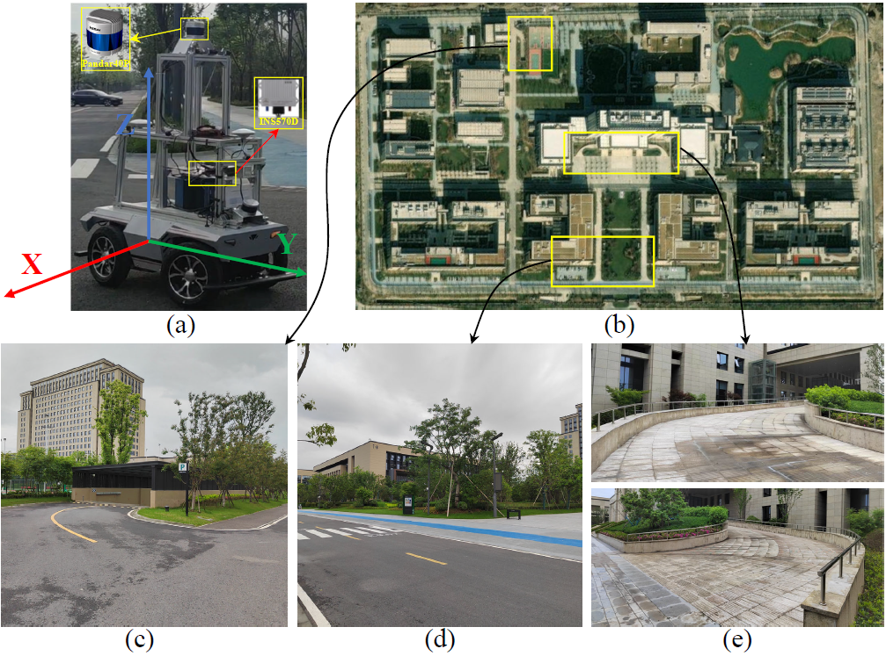

# CVR-LSE: Compact Vectorization Representation of Local Static Environments for Unmanned Ground Vehicles
Motivated by the requirement of robust and compact local environment perception, This repository contains code for a novel and compact vectorization representation approach of local static environments for unmanned ground vehicles, called **CVR-LSE**.




To run this project in minutes, check  [Dependency](#0-Dependency) and [Quick Start](#1-Quick-Start). Please refer to README.md in each folder to learn more about the contents.

Please cite the following paper if you use this project in your research: 

> H. Gao, Q. Qiu, W Hua, X. Zhang, Z Han, and S. Zhang, "CVR-LSE: Compact Vectorization Representation of Local Static Environments for Unmanned Ground Vehicles". *arXiv* preprint, submitted.

## Table of Contents

* [Dependency](#0-Dependency)
* [Quick Start](#1-Quick-Start)
* [Setup](#2-Setup)

## 0. Dependency
- [ROS](http://wiki.ros.org/ROS/Installation) (tested with Melodic)
- [gtsam](https://github.com/borglab/gtsam/releases) (Georgia Tech Smoothing and Mapping library, 4.0.0-alpha2)
  ```
  wget -O ~/Downloads/gtsam.zip https://github.com/borglab/gtsam/archive/4.0.0-alpha2.zip
  cd ~/Downloads/ && unzip gtsam.zip -d ~/Downloads/
  cd ~/Downloads/gtsam-4.0.0-alpha2/
  mkdir build && cd build
  cmake ..
  sudo make install
  ```

## 1. Quick Start

The project has been tested on 18.04 (ROS Melodic), and it can also be tested in other ROS versions (such as Kinetic with Ubuntu 16.04 and Noetic with Ubuntu 20.04). In the following we will take ROS Melodic version as the example. 

At first, we have modified the well-known [LIO-SAM](https://github.com/TixiaoShan/LIO-SAM), and obtain the new project called [ldiar_odo](https://github.com/ghm0819/lidar_odo), which is used to obtain the real-time vehicle pose. Then create and initialize a ROS workspace, run the following commands to clone this repo and build it:

```
$ mkdir -p ~/catkin_ws/src
$ cd ~/catkin_ws/src
$ catkin_init_workspace
$ git clone https://github.com/ghm0819/lidar_odo
$ cd ..
$ catkin_make
```

After the above preparation, in the same workspace, run the following commands:

```
$ cd ~/catkin_ws/src
$ git clone https://github.com/ghm0819/cvr_lse
$ cd ..
$ catkin_make
```

Finally

```
$ source devel/setup.bash
$ roslaunch cvr_lse cvr_lse.launch
```

## 2. Setup

The dataset with LiDAR information and IMU information is needed, and the calibration parameters of the LiDAR sensor and the vehicle should also be prepared in advance, change the parameter value in the config file. Then you should change the corresponding topic name in the launch file and config file, and open a new terminal and  play the bag

```
$ rosbag play --clock your_bag_name 
```

## Acknowledgement

We make use of [**linefit_ground_segmentation**](https://github.com/lorenwel/linefit_ground_segmentation) for ground_segmentation, and [**grid_map_library**](https://github.com/ANYbotics/grid_map) for maintaining the local grid map, [**LIO-SAM**](https://github.com/TixiaoShan/LIO-SAM) for real-time vehicle pose.

